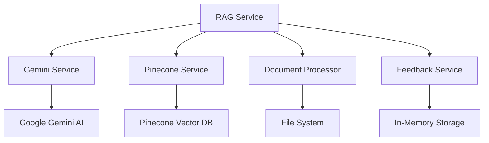

# Project Analysis Summary
# RAG Chatbot - Tư Vấn Nghề Nghiệp

**Analysis Date:** December 2024  
**Analyst:** System Analyst  
**Project Version:** 1.3

---

## Files Analyzed

### 1. Configuration Files
- **package.json**: Dependencies, scripts, and project metadata
- **tsconfig.json**: TypeScript configuration with path aliases
- **next.config.js**: Next.js configuration
- **eslint.config.js**: ESLint configuration
- **postcss.config.js**: PostCSS configuration
- **prettier.config.js**: Code formatting configuration
- **.env.example**: Environment variables template
- **src/env.js**: Environment validation schema

### 2. Documentation Files
- **README.md**: Project overview, setup instructions, and usage guide
- **SETUP.md**: Quick setup instructions and API key configuration

### 3. Frontend Components
- **src/app/layout.tsx**: Root layout with Open Sans font configuration
- **src/app/page.tsx**: Main chat interface with markdown rendering
- **src/styles/globals.css**: Global styles and TailwindCSS configuration

### 4. API Routes
- **src/app/api/ask/route.ts**: Question processing endpoint
- **src/app/api/feedback/route.ts**: Feedback collection endpoint
- **src/app/api/ingest/route.ts**: Document ingestion endpoint


### 5. Service Layer
- **src/lib/services/ragService.ts**: Main RAG orchestration service
- **src/lib/services/geminiService.ts**: Google Gemini AI integration
- **src/lib/services/pineconeService.ts**: Pinecone vector database service
- **src/lib/services/documentProcessor.ts**: DOCX document processing
- **src/lib/services/feedbackService.ts**: User feedback management
- **src/lib/services/mockStorage.ts**: In-memory data storage


### 7. Sample Documents
- **documents/sample-career-guide.docx**: Sample career guidance document
- **documents/sample-career-guide.txt**: Text version of sample document

---

## Key Findings

### Technology Stack
- **Frontend**: Next.js 15.2.3, React 19.0.0, TypeScript 5.8.2
- **Styling**: TailwindCSS 4.0.15, Open Sans font
- **Backend**: Next.js API Routes
- **AI Services**: Google Gemini AI, Pinecone Vector Database
- **Document Processing**: mammoth.js for DOCX parsing
- **Markdown Rendering**: react-markdown with remark-gfm

### System Capabilities
1. **Document Ingestion**: Processes DOCX files and creates vector embeddings
2. **Intelligent Q&A**: Classifies questions and provides context-aware responses
3. **Feedback System**: Collects user feedback and learns from interactions, with offline support
4. **Conversation Management**: Maintains conversation history and context with reset capability
5. **Markdown Rendering**: Rich text formatting for bot responses
6. **User Controls**: Keyboard shortcuts and conversation reset functionality

### Architecture Patterns
- **Service-Oriented**: Modular service layer with clear separation of concerns
- **Type-Safe APIs**: Full TypeScript integration with Next.js API Routes
- **Environment Management**: Secure configuration with validation
- **Error Handling**: Comprehensive error handling and logging
- **Responsive Design**: Mobile-friendly interface with TailwindCSS

### Data Flow
1. Documents → Processing → Vector Embeddings → Pinecone Storage
2. User Questions → Classification → RAG/General Response → Markdown Display
3. User Feedback → Storage → Learning → Improved Responses

---

## Project Structure Analysis

```
rag-demo/
├── 📁 src/
│   ├── 📁 app/                 # Next.js App Router
│   │   ├── 📁 api/            # RESTful API endpoints
│   │   ├── 📄 layout.tsx      # Root layout component
│   │   └── 📄 page.tsx        # Main chat interface
│   ├── 📁 lib/
│   │   └── 📁 services/       # Business logic services
│   └── 📁 styles/             # Global CSS styles
├── 📁 documents/              # Document storage
│   ├── 📄 sample-career-guide.docx
│   ├── 📄 sample-career-guide.txt
│   └── 📁 SRS/                # Documentation
│       ├── 📄 RAG-Chatbot-SRS.md
│       └── 📄 Project-Analysis-Summary.md
├── 📁 public/                 # Static assets
└── 📄 Configuration files     # Various config files
```

---

## Technical Implementation Details

### Service Dependencies


### API Endpoints
- **POST /api/ask**: Question processing with conversation management
- **POST /api/ingest**: Document ingestion and vector creation
- **GET /api/ingest**: System status and ingestion statistics
- **POST /api/feedback**: User feedback collection
- **GET /api/feedback**: Feedback statistics retrieval

### Environment Variables
- **PINECONE_API_KEY**: Pinecone vector database access
- **PINECONE_ENVIRONMENT**: Pinecone deployment environment
- **PINECONE_INDEX_NAME**: Vector index name
- **GEMINI_API_KEY**: Google Gemini AI access
- **OPENAI_API_KEY**: Optional OpenAI integration

---

## Quality Attributes

### Performance
- Response time targets: < 5 seconds for questions
- Vector search: < 2 seconds
- Document processing: > 1 MB/minute

### Scalability
- Concurrent users: Up to 100 simultaneous sessions
- Vector capacity: Up to 10,000 document chunks
- Horizontal scaling support

### Security
- API key protection via environment variables
- Input validation and sanitization
- HTTPS for external communications
- Session isolation

### Usability
- Intuitive chat interface
- Markdown-formatted responses
- Interactive feedback system
- Mobile-responsive design
- Keyboard shortcuts (Ctrl+Shift+C for conversation reset)
- Confirmation dialogs for destructive actions

---

## Recommendations

### Immediate Improvements
1. **Error Handling**: Enhance error messages and recovery mechanisms
2. **Caching**: Implement response caching for frequently asked questions
3. **Monitoring**: Add comprehensive logging and performance monitoring
4. **Testing**: Implement unit and integration test suites

### Future Enhancements
1. **Multi-language Support**: Extend beyond Vietnamese language
2. **Real-time Features**: WebSocket-based live chat
3. **Advanced Analytics**: User interaction tracking and insights
4. **Mobile App**: Native mobile application development

---

## Conclusion

The RAG Chatbot project demonstrates a well-architected, modern web application that successfully integrates advanced AI capabilities with a user-friendly interface. The modular design, comprehensive documentation, and thoughtful technology choices position the system for maintainability and future growth.

The combination of Next.js, TypeScript, and AI services creates a robust foundation for an intelligent career counseling system that can effectively serve users while continuously improving through feedback mechanisms. 