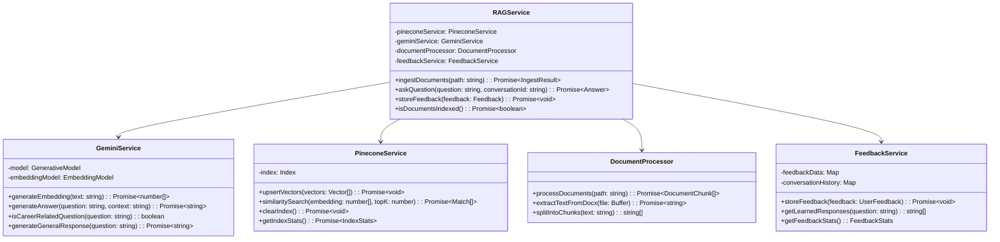

# Software Requirements Specification (SRS)
# RAG Chatbot - Tư Vấn Nghề Nghiệp

**Version:** 1.2  
**Date:** December 2024  
**Project:** RAG-based Career Counseling Chatbot  
**Technology Stack:** Next.js 15, TypeScript, Pinecone, Google Gemini AI, TailwindCSS

---

## 1. Introduction

### 1.1 Purpose
This Software Requirements Specification (SRS) document describes the functional and non-functional requirements for a Retrieval-Augmented Generation (RAG) based career counseling chatbot system. The system is designed to provide intelligent career advice by leveraging document-based knowledge retrieval and AI-powered response generation.

### 1.2 Scope
The RAG Chatbot system provides:
- **Document Processing**: Automated ingestion and processing of career guidance documents (DOCX format)
- **Intelligent Question Classification**: Distinguishes between career-related and general conversation queries
- **Vector-based Retrieval**: Uses semantic search to find relevant document chunks
- **AI-powered Response Generation**: Generates contextual responses using Google Gemini AI
- **User Feedback System**: Collects and learns from user feedback to improve responses
- **Conversation Management**: Maintains conversation context and history
- **Markdown Response Rendering**: Rich text formatting for better readability

### 1.3 Definitions and Acronyms
- **RAG**: Retrieval-Augmented Generation
- **LLM**: Large Language Model
- **API**: Application Programming Interface
- **UI/UX**: User Interface/User Experience
- **DOCX**: Microsoft Word Document format
- **Vector Database**: Database optimized for vector similarity search
- **Embedding**: Vector representation of text data
- **Chunk**: Segmented portion of a document

---

## 2. Overall Description

### 2.1 Product Perspective

```mermaid
graph TB
    subgraph "Frontend Layer"
        UI[React UI Components]
        MD[Markdown Renderer]
        FB[Feedback Interface]
    end
    
    subgraph "API Layer"
        ASK[/api/ask]
        ING[/api/ingest]
        FBK[/api/feedback]
        TRPC[tRPC Routes]
    end
    
    subgraph "Service Layer"
        RAG[RAG Service]
        GEM[Gemini Service]
        PIN[Pinecone Service]
        DOC[Document Processor]
        FBS[Feedback Service]
    end
    
    subgraph "External Services"
        GEMINI[Google Gemini AI]
        PINECONE[Pinecone Vector DB]
        DOCS[Document Storage]
    end
    
    UI --> ASK
    UI --> ING
    UI --> FBK
    MD --> UI
    FB --> FBK
    
    ASK --> RAG
    ING --> RAG
    FBK --> FBS
    
    RAG --> GEM
    RAG --> PIN
    RAG --> DOC
    RAG --> FBS
    
    GEM --> GEMINI
    PIN --> PINECONE
    DOC --> DOCS
```

### 2.2 Product Functions

#### 2.2.1 Core Functions
1. **Document Ingestion and Processing**
2. **Intelligent Question Answering**
3. **User Feedback Collection and Learning**
4. **Conversation Context Management**
5. **System Health Monitoring**

#### 2.2.2 System Architecture


### 2.3 User Classes and Characteristics

#### 2.3.1 Primary Users
- **Career Seekers**: Individuals seeking career guidance and advice
- **Students**: University/college students planning their career paths
- **Professionals**: Working professionals considering career changes

#### 2.3.2 System Administrators
- **Technical Staff**: Responsible for system maintenance and monitoring
- **Content Managers**: Responsible for updating and managing career guidance documents

---

## 3. System Features

### 3.1 Document Ingestion and Processing

#### 3.1.1 Description
The system automatically processes DOCX files containing career guidance information, converts them to vector embeddings, and stores them in a vector database for retrieval.

#### 3.1.2 Functional Requirements


**FR-1.1**: The system SHALL process DOCX files from the `/documents` directory  
**FR-1.2**: The system SHALL split documents into chunks of 350 characters with 20 character overlap  
**FR-1.3**: The system SHALL generate vector embeddings using Google Gemini AI  
**FR-1.4**: The system SHALL store embeddings in Pinecone vector database  
**FR-1.5**: The system SHALL provide ingestion statistics (total chunks, processed files)  

### 3.2 Intelligent Question Answering

#### 3.2.1 Description
The system provides intelligent responses to user questions by classifying question types and using appropriate response strategies.

#### 3.2.2 Question Processing Flow


**FR-2.1**: The system SHALL classify questions as career-related or general conversation  
**FR-2.2**: The system SHALL perform semantic search for career-related questions  
**FR-2.3**: The system SHALL retrieve top-k relevant document chunks  
**FR-2.4**: The system SHALL generate contextual responses using retrieved information  
**FR-2.5**: The system SHALL provide source attribution for career advice  
**FR-2.6**: The system SHALL handle general conversation with appropriate responses  
**FR-2.7**: The system SHALL format responses in Markdown for rich text display  

### 3.3 User Feedback and Learning System

#### 3.3.1 Description
The system collects user feedback on responses and uses this information to improve future interactions.

#### 3.3.2 Feedback Processing Flow


**FR-3.1**: The system SHALL collect user feedback (positive, negative, neutral)  
**FR-3.2**: The system SHALL store feedback with question-answer pairs  
**FR-3.3**: The system SHALL reuse positively-rated responses for similar questions  
**FR-3.4**: The system SHALL maintain feedback statistics  
**FR-3.5**: The system SHALL support offline feedback storage when API is unavailable  
**FR-3.6**: The system SHALL retry sending stored offline feedback when connectivity is restored  
**FR-3.7**: The system SHALL support optional user comments  

### 3.4 Conversation Context Management

#### 3.4.1 Description
The system maintains conversation history and context to provide more relevant responses.

**FR-4.1**: The system SHALL maintain conversation history per session  
**FR-4.2**: The system SHALL use conversation context for better response generation  
**FR-4.3**: The system SHALL assign unique conversation IDs  
**FR-4.4**: The system SHALL limit context to recent messages (last 3 relevant messages)  
**FR-4.5**: The system SHALL allow users to reset/clear conversation history  
**FR-4.6**: The system SHALL generate a new conversation ID when conversation is reset  

---

## 4. External Interface Requirements

### 4.1 User Interfaces

#### 4.1.1 Main Chat Interface
- **Header**: System title, status indicator, action buttons (status check, document ingestion, conversation reset)
- **Chat Area**: Message history with user and assistant messages
- **Input Area**: Text input field and send button
- **Feedback Controls**: Rating buttons for each assistant response
- **Source Display**: Document sources for career-related responses
- **Empty State**: Visual indicator when no messages are present

#### 4.1.2 System Administration Interface
- **Status Dashboard**: System health, vector count, ingestion status
- **Document Management**: Upload and manage career guidance documents
- **Feedback Analytics**: Review user feedback and system performance

### 4.2 Hardware Interfaces
- **Standard Web Browser**: Chrome, Firefox, Safari, Edge
- **Mobile Devices**: Responsive design for tablets and smartphones

### 4.3 Software Interfaces

#### 4.3.1 External APIs


**SI-1**: Google Gemini AI API v1
- **Purpose**: Text embeddings and response generation
- **Protocol**: HTTPS REST API
- **Authentication**: API Key
- **Rate Limits**: As per Google's API limits

**SI-2**: Pinecone Vector Database API
- **Purpose**: Vector storage and similarity search
- **Protocol**: HTTPS REST API
- **Authentication**: API Key
- **Index Configuration**: 768-dimensional vectors

### 4.4 Communication Interfaces

#### 4.4.1 API Endpoints


**API-1**: `/api/ask` - Question Processing
- **Method**: POST
- **Input**: `{ question: string, conversationId?: string }`
- **Output**: `{ answer: string, sources: string[], confidence: number, isCareerRelated: boolean }`

**API-2**: `/api/ingest` - Document Ingestion
- **Method**: POST
- **Input**: `{ clearIndex?: boolean, documentsPath?: string }`
- **Output**: `{ totalChunks: number, processedFiles: string[], statistics: object }`

**API-3**: `/api/feedback` - Feedback Collection
- **Method**: POST
- **Input**: `{ question: string, answer: string, rating: string, comment?: string }`
- **Output**: `{ success: boolean, message: string }`

---

## 5. Non-Functional Requirements

### 5.1 Performance Requirements

**NFR-1.1**: The system SHALL respond to user questions within 5 seconds  
**NFR-1.2**: The system SHALL support concurrent users (up to 100 simultaneous sessions)  
**NFR-1.3**: Document ingestion SHALL process files at minimum 1 MB/minute  
**NFR-1.4**: Vector search SHALL return results within 2 seconds  

### 5.2 Safety Requirements

**NFR-2.1**: The system SHALL validate all user inputs to prevent injection attacks  
**NFR-2.2**: The system SHALL implement rate limiting to prevent abuse  
**NFR-2.3**: The system SHALL sanitize all output to prevent XSS attacks  

### 5.3 Security Requirements

**NFR-3.1**: API keys SHALL be stored securely in environment variables  
**NFR-3.2**: The system SHALL use HTTPS for all external API communications  
**NFR-3.3**: User sessions SHALL be isolated and not share data  
**NFR-3.4**: The system SHALL not store personally identifiable information  

### 5.4 Software Quality Attributes

#### 5.4.1 Reliability
**NFR-4.1**: The system SHALL have 99% uptime during business hours  
**NFR-4.2**: The system SHALL gracefully handle API failures with fallback responses  
**NFR-4.3**: The system SHALL recover from temporary service outages  

#### 5.4.2 Usability
**NFR-4.4**: The user interface SHALL be intuitive and require no training  
**NFR-4.5**: The system SHALL provide clear feedback for all user actions  
**NFR-4.6**: Response formatting SHALL be readable and well-structured  
**NFR-4.7**: The system SHALL provide keyboard shortcuts for common actions  
**NFR-4.8**: The system SHALL display confirmation dialogs for destructive actions  

#### 5.4.3 Scalability
**NFR-4.7**: The system SHALL support horizontal scaling for increased load  
**NFR-4.8**: Vector database SHALL handle up to 10,000 document chunks  
**NFR-4.9**: The system SHALL support adding new document types in the future  

---

## 6. System Architecture

### 6.1 High-Level Architecture


### 6.2 Service Architecture



---

## 7. Data Requirements

### 7.1 Data Flow Diagram


### 7.2 Data Storage

#### 7.2.1 Vector Database Schema (Pinecone)
```typescript
interface VectorMetadata {
  id: string;
  text: string;
  source: string;
  chunkIndex: number;
  documentTitle: string;
  timestamp: string;
}
```

#### 7.2.2 Feedback Data Schema
```typescript
interface UserFeedback {
  id: string;
  question: string;
  answer: string;
  rating: 'positive' | 'negative' | 'neutral';
  timestamp: Date;
  conversationId: string;
  isCareerRelated: boolean;
  sources?: string[];
  userComment?: string;
}
```

#### 7.2.3 Conversation Data Schema
```typescript
interface ConversationHistory {
  conversationId: string;
  messages: Array<{
    role: 'user' | 'assistant';
    content: string;
    timestamp: Date;
    isCareerRelated?: boolean;
  }>;
  createdAt: Date;
  lastActivity: Date;
}
```

---

## 8. Implementation Details

### 8.1 Technology Stack

#### 8.1.1 Frontend Technologies
- **Framework**: Next.js 15.2.3 with App Router
- **Language**: TypeScript 5.8.2
- **UI Library**: React 19.0.0
- **Styling**: TailwindCSS 4.0.15
- **Markdown Rendering**: react-markdown 10.1.0 with remark-gfm
- **State Management**: React hooks and context
- **HTTP Client**: Built-in fetch API

#### 8.1.2 Backend Technologies
- **Runtime**: Node.js with Next.js API Routes
- **Language**: TypeScript
- **API Framework**: tRPC 11.0.0 for type-safe APIs
- **Validation**: Zod 3.24.2 for schema validation
- **Environment**: @t3-oss/env-nextjs for environment variable management

#### 8.1.3 AI and Vector Database
- **LLM Provider**: Google Gemini AI (@google/generative-ai 0.24.1)
- **Vector Database**: Pinecone (@pinecone-database/pinecone 6.1.1)
- **Text Processing**: LangChain (@langchain/textsplitters 0.1.0)
- **Document Processing**: mammoth 1.9.1 for DOCX parsing

#### 8.1.4 Development Tools
- **Package Manager**: pnpm 10.11.0
- **Linting**: ESLint 9.23.0 with typescript-eslint
- **Formatting**: Prettier 3.5.3
- **Type Checking**: TypeScript compiler

### 8.2 File Structure

```
rag-demo/
├── src/
│   ├── app/                    # Next.js App Router
│   │   ├── api/               # API Routes
│   │   │   ├── ask/           # Question processing
│   │   │   ├── feedback/      # Feedback collection
│   │   │   ├── ingest/        # Document ingestion
│   │   │   └── trpc/          # tRPC routes
│   │   ├── layout.tsx         # Root layout
│   │   └── page.tsx           # Main chat interface
│   ├── lib/
│   │   └── services/          # Business logic services
│   │       ├── ragService.ts
│   │       ├── geminiService.ts
│   │       ├── pineconeService.ts
│   │       ├── documentProcessor.ts
│   │       └── feedbackService.ts
│   ├── server/                # tRPC server setup
│   ├── styles/                # Global styles
│   └── trpc/                  # tRPC client setup
├── documents/                 # Document storage
│   └── SRS/                   # This documentation
├── public/                    # Static assets
└── Configuration files
```

---

## 9. Testing Requirements

### 9.1 Unit Testing
- **Service Layer**: Test all business logic methods
- **API Routes**: Test request/response handling
- **Utilities**: Test helper functions and data processing

### 9.2 Integration Testing
- **API Integration**: Test external service connections
- **Database Operations**: Test vector storage and retrieval
- **End-to-End Workflows**: Test complete user journeys

### 9.3 Performance Testing
- **Load Testing**: Test system under concurrent user load
- **Response Time**: Measure API response times
- **Memory Usage**: Monitor memory consumption during operations

---

## 10. Deployment and Maintenance

### 10.1 Deployment Requirements
- **Platform**: Vercel or similar Next.js hosting platform
- **Environment Variables**: Secure storage of API keys
- **Domain**: Custom domain with HTTPS
- **CDN**: Content delivery for static assets

### 10.2 Monitoring and Logging
- **Application Logs**: Comprehensive logging for debugging
- **Performance Metrics**: Response times and error rates
- **User Analytics**: Usage patterns and feedback trends
- **Health Checks**: System status monitoring

### 10.3 Backup and Recovery
- **Vector Database**: Regular backups of Pinecone index
- **Document Storage**: Version control for source documents
- **Configuration**: Backup of environment variables and settings

---

## 11. Risk Analysis

### 11.1 Technical Risks
- **API Rate Limits**: Google Gemini and Pinecone API limitations
- **Service Outages**: Dependency on external services
- **Scalability**: Performance degradation with large document sets
- **Data Loss**: Vector database corruption or loss

### 11.2 Mitigation Strategies
- **Rate Limiting**: Implement client-side rate limiting and queuing
- **Fallback Responses**: Provide cached or default responses during outages
- **Performance Optimization**: Implement caching and query optimization
- **Backup Strategy**: Regular backups and disaster recovery procedures

---

## 12. Future Enhancements

### 12.1 Planned Features
- **Multi-language Support**: Support for multiple languages beyond Vietnamese
- **Advanced Analytics**: Detailed user interaction analytics
- **Document Versioning**: Track and manage document updates
- **Real-time Chat**: WebSocket-based real-time communication
- **Mobile App**: Native mobile applications
- **Voice Interface**: Speech-to-text and text-to-speech capabilities

### 12.2 Scalability Improvements
- **Microservices Architecture**: Split into independent services
- **Caching Layer**: Redis for response caching
- **Load Balancing**: Distribute load across multiple instances
- **Database Optimization**: Advanced vector search optimizations

---

## 13. Conclusion

This SRS document provides a comprehensive specification for the RAG Chatbot system, covering all functional and non-functional requirements, system architecture, and implementation details. The system successfully combines modern web technologies with advanced AI capabilities to deliver an intelligent career counseling solution.

The modular architecture ensures maintainability and scalability, while the comprehensive feedback system enables continuous improvement of the AI responses. The use of industry-standard technologies and best practices ensures the system's reliability and performance.

---

**Document Approval**

| Role | Name | Date | Signature |
|------|------|------|-----------|
| Product Owner | | | |
| Technical Lead | | | |
| QA Lead | | | |
| Stakeholder | | | |

---

**Revision History**

| Version | Date | Author | Description |
|---------|------|--------|-------------|
| 1.0 | December 2024 | System Analyst | Initial SRS document |

---

*This document is confidential and proprietary. Distribution is restricted to authorized personnel only.*